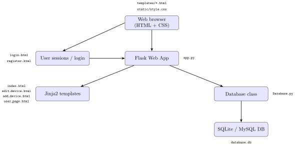

# Slotkeeper

Slotkeeper on web-sovellus, jonka avulla käyttäjät voivat varata ja hallinnoida jaettuja testilaitteita.

## Ominaisuudet

*   **Käyttäjähallinta:**
    *   Rekisteröityminen ja sisäänkirjautuminen.
    *   Oma käyttäjäsivu, josta näkee omat varaukset, luodut laitteet ja varaushistorian ja statistiikan.
*   **Laitehallinta:**
    *   Laitteiden lisääminen, muokkaaminen ja poistaminen.
    *   Kaikkien laitteiden listaaminen ja selaaminen sivutuksella.
    *   Laitteiden haku nimen tai varaustilanteen perusteella.
*   **Varaustoiminnallisuus:**
    *   Laitteiden varaaminen määräajaksi.
    *   Omien varausten vapauttaminen ennen määräajan päättymistä.
    *   Selkeä näkymä laitteiden varaustilanteesta.
*   **Kommentointi:**
    *   Käyttäjät voivat lisätä kommentteja laitteisiin.
    *   Laitteiden kommentit näytetään laitteen tietojen yhteydessä.
    *   Kommentin voi poistaa vain sen alkuperäinen kirjoittaja.
*   **Turvallisuus:**
    *   Salasanojen turvallinen tallennus (hashaus).
    *   CSRF (Cross-Site Request Forgery) -suojaus lomakkeilla.
*   **Käyttöliittymä:**
    *   Responsiivinen perusulkoasu.
    *   Paginointi laitelistoille suorituskyvyn parantamiseksi suurilla datamäärillä.
    *   Visuaaliset piirakkakaaviot käyttäjäsivulla näyttämään varausstatistiikkaa (varauskerrat ja -kestot).

## Teknologiat

*   **Backend:** Python, Flask
*   **Tietokanta:** SQLite
*   **Frontend:** HTML, CSS

## Asennus ja käyttöönotto

### Vaatimukset

*   Python 3.x
*   pip

### Asennusvaiheet

1.  **Kloonaa repositorio:**
    ```bash
    git clone https://github.com/juhapekka/slotkeeper.git
    cd slotkeeper
    ```

2.  **Luo ja aktivoi virtuaaliympäristö:**
    ```bash
    python3 -m venv venv
    source venv/bin/activate
    ```

3.  **Asenna vaaditut Python-kirjastot:**
    Sovellus käyttää seuraavia kirjastoja, voit asentaa ne manuaalisesti:
    ```bash
    pip install flask
    ```

4.  **Luo tietokannan taulut:**
    Tietokantaskeema määritellään `schema.sql`-tiedostossa. Luo tietokanta ja sen taulut ajamalla:
    ```bash
    sqlite3 database.db < schema.sql
    ```
    Tämä luo `database.db`-tiedoston projektiisi, jos sitä ei ole, ja alustaa taulut.

5.  **Määritä sovelluksen salainen avain:**
    Sovellus käyttää salaista avainta sessioiden allekirjoittamiseen. Muokkaa `config.py`-tiedostoa projektin juuressa:
    ```python
    secret_key = 'korvaa_tama_todella_salaisella_avaimella'
    ```
    **TÄRKEÄÄ:** Korvaa `'korvaa_tama_todella_salaisella_avaimella'` jollakin pitkällä, satunnaisella ja vahvalla merkkijonolla.

### Käynnistäminen

Kun asennus on valmis, voit käynnistää Flask-kehityspalvelimen:
```bash
flask run
```

Sovelluksen pitäisi olla saatavilla oletusosoitteessa http://127.0.0.1:5000/.
## Demo- ja testidata
### Pieni demodata
Voit lisätä pienen määrän esimerkkidataa (muutamia laitteita ja kommentteja) ajamalla:

```bash
sqlite3 database.db < demo.sql
```

Tämä skripti lisää myös käyttäjän 'DemoKäyttäjä' salasanalla 'demoni'. Huomaa että demo.sql olettaa, että schema.sql on ajettu ensin.
### Suuri testidata (Stressitestaus)
Projektin mukana tulee Python-skripti seed.py, jolla voit generoida suuren määrän testidataa tietokantaan. Skripti luo oletuksena:
100 000 käyttäjää
100 000 testilaitetta
100 kommenttia jokaiselle laitteelle (yhteensä 10 miljoonaa kommenttia)
Käyttö:
```
python seed.py
```

Suorituskyky suurilla datamäärillä: Sovellukseen on toteutettu tietokantaindeksointi ja paginointi laitelistoille. Testeissä yllä mainituilla suurilla datamäärillä käyttöliittymän suorituskyvyssä ei ole havaittu merkittävää muutosta perustoiminnoissa.

## Rakenne
* app.py: Pääasiallinen Flask-sovellustiedosto, sisältää reitit ja sovelluslogiikan.
* Database.py: Luokka tietokantatoiminnoille (SQLite).
* schema.sql: SQL-lausekkeet tietokantataulujen ja indeksien luomiseen.
* demo.sql: SQL-lausekkeet pienen demomäärän lisäämiseen.
* seed.py: Python-skripti suuren testidatamäärän generoimiseen.
* config.py: Sovelluksen konfiguraatiotiedot.
* slotkeeperutil.py: työkalufunktio moduli
* templates/: HTML-templatekansio (Jinja2).
  * index.html: Pääsivu laitteiden listaukselle ja modaaleille.
  * login.html: Sisäänkirjautumissivu.
  * register.html: Rekisteröitymissivu.
  * add_device.html: Laitteen lisäyssivu.
  * edit_device.html: Laitteen muokkaussivu.
  * user_page.html: Käyttäjän omien tietojen sivu.
* static/: Staattisten tiedostojen kansio.
  * style.css: Sovelluksen CSS-tyylit.
  * background.jpg: Esimerkkitaustakuva.


